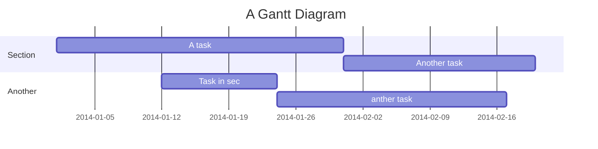

title: 'Team_1.md'
disqus: md
---

Central Air Conditioning System 
===
###### tags: `2019` `NTUT_CSIE` `SRS` `project` 

Team information
---

[TOC]

Problem statement
---


Decompose the problem into subproblems
---


Analysis (e.g., context diagram, problem frame diagrams, shared phenomenon, frame concern, state machine diagram, model domain, etc.)
---
```sequence
Alice->Bob: Hello Bob, how are you?
Note right of Bob: Bob thinks
Bob-->Alice: I am good thanks!
Note left of Alice: Alice responds
Alice->Bob: Where have you been?
```


Recombine the subproblems
---

Problem dependency graph
---

User stories
---

Gherkin scenarios
---

:::info
**Find this document incomplete?** Leave a comment!
:::

## Welcome to GitHub Pages

此網頁之DNS位置 https://daojun0690.github.io/123/

You can use the [editor on GitHub](https://github.com/DAOjun0690/123/edit/master/README.md) to maintain and preview the content for your website in Markdown files.

Whenever you commit to this repository, GitHub Pages will run [Jekyll](https://jekyllrb.com/) to rebuild the pages in your site, from the content in your Markdown files.

---
